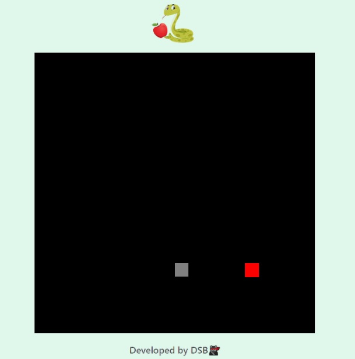

<h2 align="center">Projeto: Jogo da Cobrinha</h2
​    

## 🚀 Projeto feito durante o Bootcamp "HTML Web Developer" da Digital Innovation One.

 
 

## 🛠 Linguagens:

* HTML
* CSS
* JavaScript

## 🛠 Ferramenta:

* Sublime 3

##  💻Visualização:

 Caso deseje ver o jogo em ação, assista o vídeo abaixo.

<a href="https://youtu.be/CmcusSxHm78" target="_blank">Clique aqui</a>

##  ✔Atualização:
24/01 - Atualizando o readme.

---

<h3>
Developed by <strong>DSB🐱‍👤</strong>
<h3>
